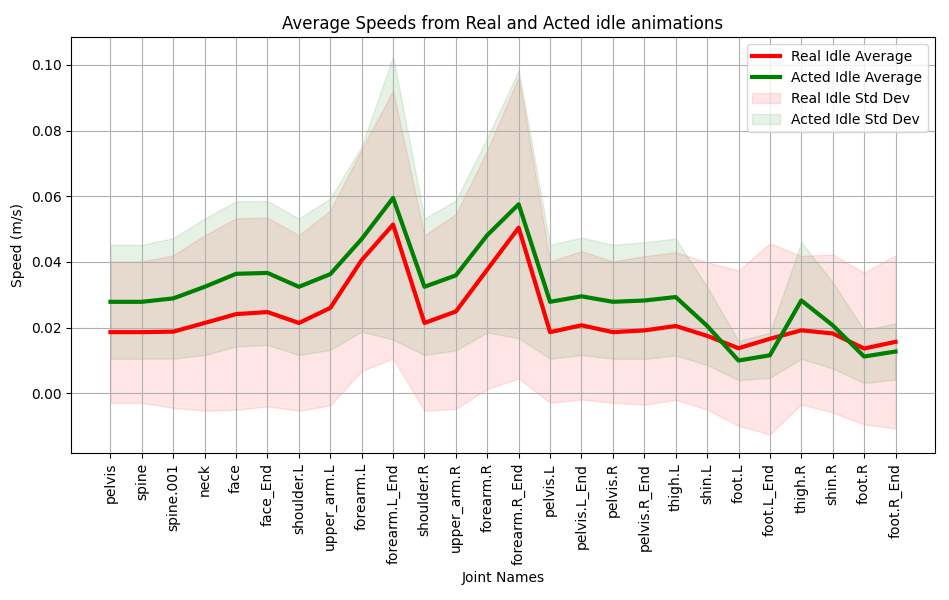

# ReActIdle dataset


This repository contains the dataset from the paper *Evaluating Idle Animation Believability: a User Perspective*. It also contains scripts to reproduce the results and graphs from the paper. 
## Dataset details
The repository contains 16 clips of acted idle animations and 10 clips of genuine idle animations. The number of the clip matches the ID of the person performing the animation, so clip *000_genuine.bvh* and *000_acted.bvh* are made by the same person.

The dataset contains 55.039 frames of acted idle motion and 27.273 frames of genuine idle motion.

You can directly clone this repository and use the BVH files provided in the *acted* and *genuine* folders.

## Reproducing the results
To reproduce the results from the paper, follow these instructions.

### Angular speeds
Execute the *plotAngularSpeeds.py* script. You will need to have numpy, scipy and matplotlib. The script will first show the average angular speeds graph from the paper, but it will also show average angular accelerations and jerks.


### Speeds
First, generate the position csv files by running *createCsvFiles.py*. You will need to have [bvhTools](https://github.com/Enekoassets/bvhTools) installed. You can easily install it with:

``` pip install bvhTools```

This will generate two new folders inside the acted and genuine bvh folders, containing the csv files with the joint positions in every frame.

Then, execute the *plotSpeeds.py* script. You will need to have numpy, pandas, scipy and matplotlib. The script will first show the average speeds graph from the paper, but it will also show average accelerations and jerks.




**Note:** The graphs involving Mixamo animations can not be directly reproduced, as they need the animations from Mixamo, which cannot be redistributed without permission. You can download those animations from Mixamo and edit the scripts to do so. First search the keyword "idle" in Mixamo, and then extract the following animation clips to BVH.

- Catwalk idle
- Catwalk idle 01
- Catwalk idle 02
- Standing idle (2 animations)
- Idle (the first 5 animations that appear in Mixamo)
- Standard idle
- Unarmed idle 01 (2 animations)
- Warrior idle
- Neutral idle

## Citing
If you use this dataset in your research, please cite it as follows:
```
@misc{landa2025evaluatingidleanimationbelievability,
      title={Evaluating Idle Animation Believability: a User Perspective}, 
      author={Eneko Atxa Landa and Elena Lazkano and Igor Rodriguez and Itsaso Rodríguez-Moreno and Itziar Irigoien},
      year={2025},
      eprint={2509.05023},
      archivePrefix={arXiv},
      primaryClass={cs.HC},
      url={https://arxiv.org/abs/2509.05023}, 
}
```
## License

The dataset provided in this repository is released under the **MIT License**.  
You are free to use, copy, modify, merge, publish, distribute, sublicense, and/or sell copies of the dataset, under the conditions outlined in the MIT License.

See [LICENSE.txt](LICENSE.txt) for full license text.
